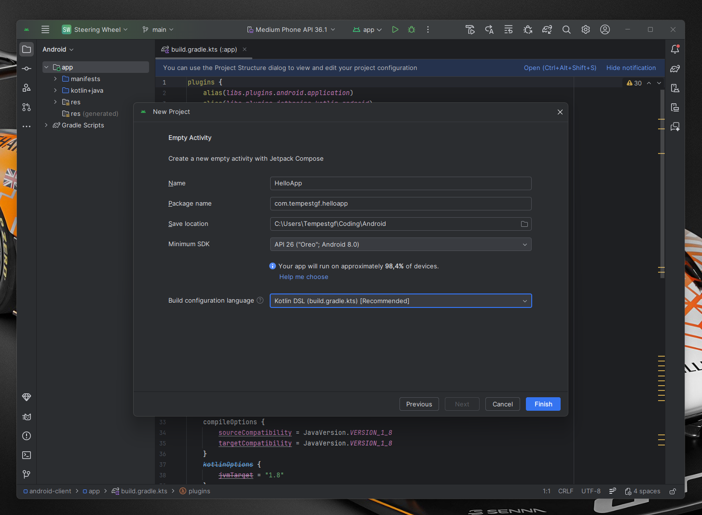
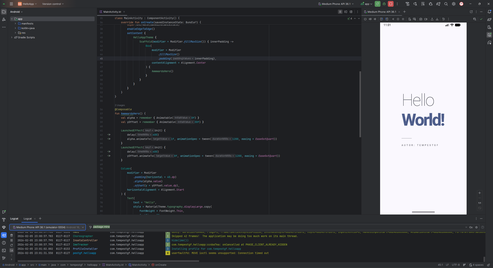
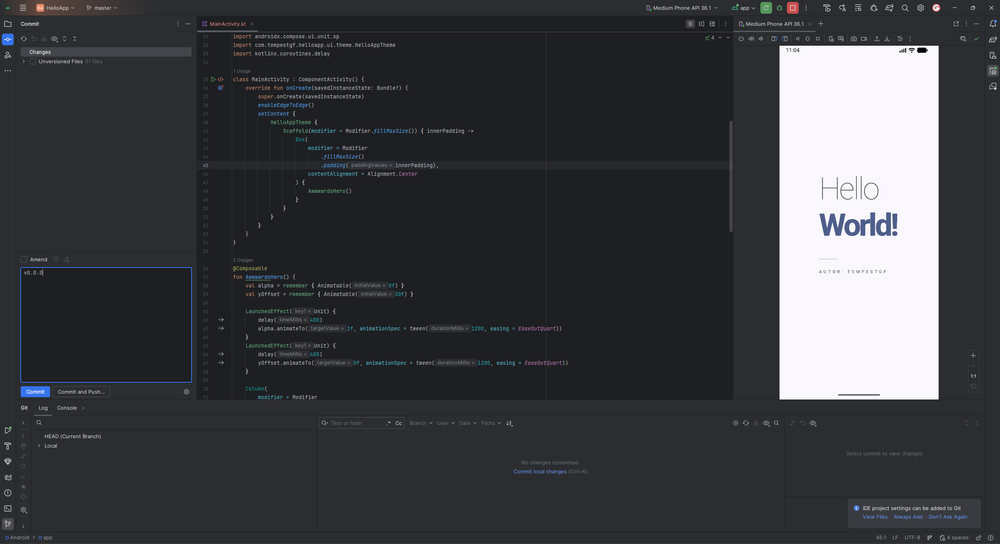

# HelloApp

Una aplicación de Android minimalista y elegante diseñada con Jetpack Compose, inspirada en las tendencias visuales de Awwwards.

## Características

- **Diseño Minimalista:** Tipografía refinada y espaciado equilibrado.
- **Animaciones Suaves:** Entrada de contenido con efectos de opacidad y desplazamiento (Smooth animations).
- **Material 3:** Implementación de las últimas guías de diseño de Android.

## Capturas de Pantalla

Aquí puedes ver la evolución del diseño de la aplicación:

## Autor

Desarrollado por **Tempestgf**.
